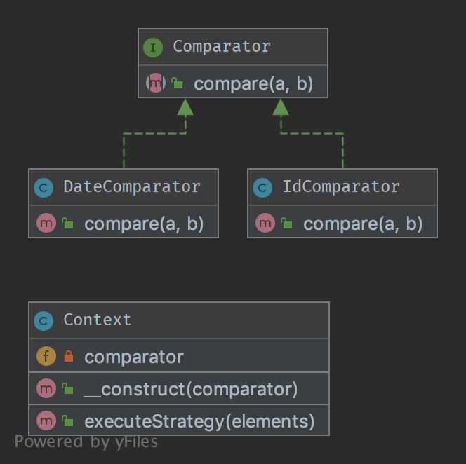
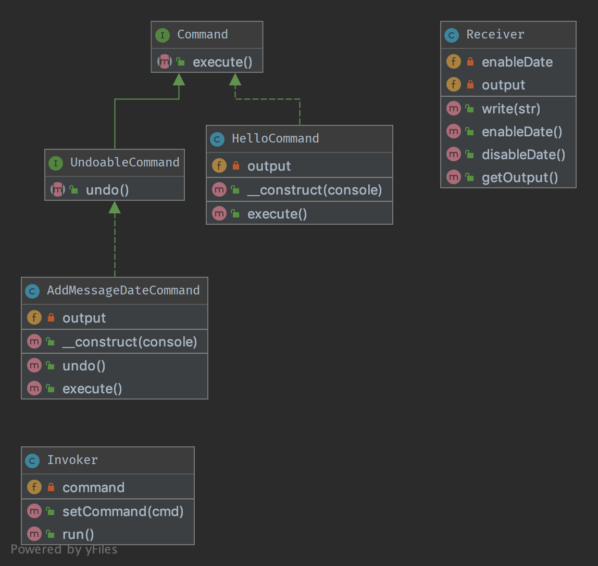
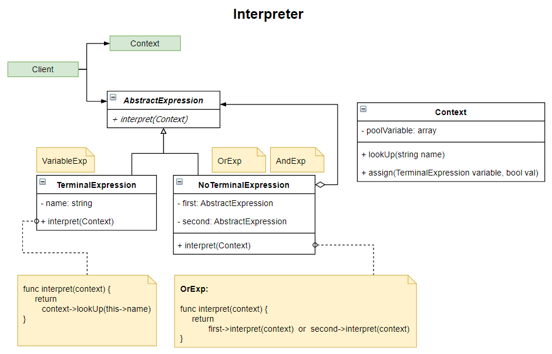
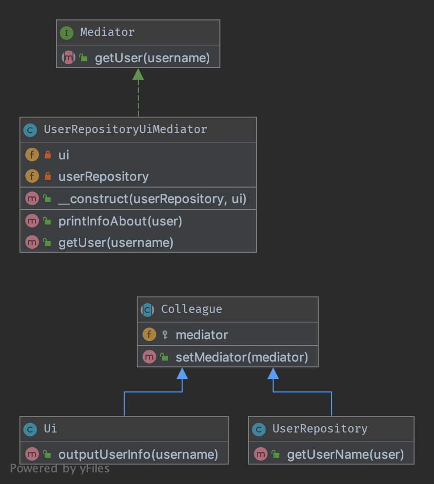
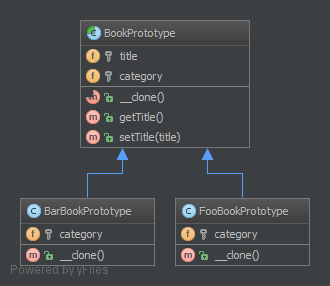

# PHP Design Patterns — Catálogo Completo con Diagramas UML

Colección de **35+ patrones de diseño** implementados en PHP con diagramas UML, organizados según la clasificación del **Gang of Four (GoF)**: Creacionales, Estructurales y de Comportamiento, más patrones adicionales de arquitectura empresarial. Cada patrón incluye código funcional y su correspondiente diagrama UML. Entorno Dockerizado para ejecución inmediata.

[](https://www.php.net/)
[](https://en.wikipedia.org/wiki/Design_Patterns)
[](https://en.wikipedia.org/wiki/Design_Patterns)
[](https://www.docker.com/)
[](https://www.uml.org/)

---

## Tabla de Contenidos

- [Sobre el Proyecto](#sobre-el-proyecto)
- [¿Qué son los Patrones de Diseño?](#qué-son-los-patrones-de-diseño)
- [Catálogo de Patrones](#catálogo-de-patrones)
  - [Patrones Creacionales](#-patrones-creacionales)
  - [Patrones Estructurales](#-patrones-estructurales)
  - [Patrones de Comportamiento](#-patrones-de-comportamiento)
  - [Patrones Adicionales](#-patrones-adicionales)
- [Diagramas UML](#diagramas-uml)
- [Estructura del Proyecto](#estructura-del-proyecto)
- [Requisitos](#requisitos)
- [Instalación](#instalación)
- [Recursos](#recursos)
- [Autor](#autor)

---

## Sobre el Proyecto

Los **patrones de diseño** son soluciones reutilizables a problemas comunes en el desarrollo de software. Fueron popularizados por el libro *"Design Patterns: Elements of Reusable Object-Oriented Software"* (1994) de Erich Gamma, Richard Helm, Ralph Johnson y John Vlissides, conocidos como el **Gang of Four (GoF)**.

Este repositorio implementa cada patrón en PHP con:

- Código funcional y autocontenido por carpeta
- Diagrama UML (`uml/uml.png`) para visualizar las relaciones entre clases
- Interfaces, clases abstractas e implementaciones concretas
- Entorno Docker para ejecutar los ejemplos sin configuración local

---

## ¿Qué son los Patrones de Diseño?

```
                        Patrones de Diseño (GoF)
                                 │
            ┌────────────────────┼────────────────────┐
            │                    │                    │
      CREACIONALES         ESTRUCTURALES        COMPORTAMIENTO
     (Cómo se crean       (Cómo se componen    (Cómo se comunican
      los objetos)          los objetos)         los objetos)
            │                    │                    │
  ┌─────────┤             ┌──────┤              ┌─────┤
  │ Abstract Factory      │ Adapter             │ Chain of Resp.
  │ Builder               │ Bridge              │ Command
  │ Factory Method        │ Composite           │ Interpreter
  │ Prototype             │ Decorator           │ Iterator
  │ Singleton             │ Facade              │ Mediator
  │ Simple Factory        │ Flyweight           │ Memento
  │ Static Factory        │ Proxy               │ Observer
  │ Pool                  │ ...                 │ State
  └───────────────        └──────────           │ Strategy
                                                │ Template Method
                                                │ Visitor
                                                └──────────────
```

---

## Catálogo de Patrones

### 🔨 Patrones Creacionales

Controlan **cómo se crean** los objetos, abstrayendo el proceso de instanciación.

| # | Patrón | Carpeta | Propósito | UML |
|---|---|---|---|---|
| 1 | **Abstract Factory** | `AbstractFactory/` | Crear familias de objetos relacionados sin especificar sus clases concretas | ✅ |
| 2 | **Builder** | `Builder/` | Construir objetos complejos paso a paso, separando construcción de representación | ✅ |
| 3 | **Factory Method** | `FactoryMethod/` | Delegar la creación de objetos a subclases mediante un método de fábrica | ✅ |
| 4 | **Prototype** | `Prototype/` | Crear objetos clonando una instancia existente (prototipo) | ✅ |
| 5 | **Singleton** | `Singleton/` | Garantizar que una clase tenga una única instancia con un punto de acceso global | ✅ |
| 6 | **Simple Factory** | `SimpleFactory/` | Encapsular la lógica de creación en un único método de fábrica | — |
| 7 | **Static Factory** | `StaticFactory/` | Factory con métodos estáticos (no requiere instanciar la fábrica) | — |
| 8 | **Pool** | `Pool/` | Reutilizar objetos costosos de crear mediante un pool de instancias | — |

#### Ejemplo: Singleton

```php
class Database
{
    private static ?Database $instance = null;

    private function __construct() {
        // Conexión privada
    }

    public static function getInstance(): Database
    {
        if (self::$instance === null) {
            self::$instance = new self();
        }
        return self::$instance;
    }

    // Prevenir clonación y deserialización
    private function __clone() {}
    private function __wakeup() {}
}

// Uso: siempre la misma instancia
$db1 = Database::getInstance();
$db2 = Database::getInstance();
var_dump($db1 === $db2); // true
```


---

### 🧩 Patrones Estructurales

Definen **cómo se componen** los objetos para formar estructuras más grandes.

| # | Patrón | Carpeta | Propósito | UML |
|---|---|---|---|---|
| 9 | **Adapter** | `Adapter/` | Convertir la interfaz de una clase en otra que el cliente espera | ✅ |
| 10 | **Bridge** | `Bridge/` | Desacoplar abstracción de implementación para que varíen independientemente | ✅ |
| 11 | **Composite** | `Composite/` | Componer objetos en estructuras de árbol para representar jerarquías parte-todo | ✅ |
| 12 | **Composition** | `Composition/` | Favorecer composición sobre herencia para reutilizar comportamiento | — |
| 13 | **Decorator** | `Decorator/` | Añadir responsabilidades dinámicamente a un objeto sin modificar su clase | ✅ |
| 14 | **Facade** | `Facade/` | Proporcionar una interfaz simplificada a un subsistema complejo | ✅ |
| 15 | **Flyweight** | `Flyweight/` | Compartir estado entre objetos similares para reducir uso de memoria | ✅ |
| 16 | **Proxy** | `Proxy/` | Controlar el acceso a un objeto mediante un sustituto o representante | ✅ |

#### Ejemplo: Adapter

```php
// Interfaz que el cliente espera
interface MediaPlayer
{
    public function play(string $filename): string;
}

// Clase existente con interfaz incompatible
class VlcPlayer
{
    public function playVlc(string $filename): string {
        return "Reproduciendo VLC: $filename";
    }
}

// Adapter: convierte VlcPlayer a MediaPlayer
class VlcAdapter implements MediaPlayer
{
    private VlcPlayer $vlcPlayer;

    public function __construct(VlcPlayer $vlcPlayer) {
        $this->vlcPlayer = $vlcPlayer;
    }

    public function play(string $filename): string {
        return $this->vlcPlayer->playVlc($filename);
    }
}

// Uso: el cliente trabaja con MediaPlayer
$player = new VlcAdapter(new VlcPlayer());
echo $player->play('video.avi'); // "Reproduciendo VLC: video.avi"
```


---

### 🔄 Patrones de Comportamiento

Definen **cómo se comunican** y distribuyen responsabilidades entre objetos.

| # | Patrón | Carpeta | Propósito | UML |
|---|---|---|---|---|
| 17 | **Chain of Responsibility** | `ChainOfResponsibility/` | Pasar una petición por una cadena de handlers hasta que uno la procese | ✅ |
| 18 | **Command** | `Command/` | Encapsular una petición como un objeto, permitiendo deshacer/rehacer | ✅ |
| 19 | **Interpreter** | `Interpreter/` | Definir una gramática y un intérprete para un lenguaje | ✅ |
| 20 | **Iterator** | `Iterator/` | Recorrer elementos de una colección sin exponer su representación interna | ✅ |
| 21 | **Mediator** | `Mediator/` | Reducir las dependencias directas entre objetos con un mediador central | ✅ |
| 22 | **Memento** | `Memento/` | Capturar y restaurar el estado interno de un objeto (undo/redo) | ✅ |
| 23 | **Observer** | `Observer/` | Notificar automáticamente a múltiples objetos cuando cambia el estado | ✅ |
| 24 | **State** | `State/` | Permitir que un objeto cambie su comportamiento cuando cambia su estado interno | ✅ |
| 25 | **Strategy** | `Strategy/` | Definir una familia de algoritmos intercambiables en tiempo de ejecución | ✅ |
| 26 | **Template Method** | `TemplateMethod/` | Definir el esqueleto de un algoritmo, delegando pasos a las subclases | ✅ |
| 27 | **Visitor** | `Visitor/` | Añadir nuevas operaciones a una jerarquía de clases sin modificarlas | ✅ |

#### Ejemplo: Strategy

```php
// Interfaz de estrategia
interface SortStrategy
{
    public function sort(array &$data): void;
}

// Estrategias concretas
class BubbleSort implements SortStrategy
{
    public function sort(array &$data): void {
        // Implementación bubble sort
        $n = count($data);
        for ($i = 0; $i < $n - 1; $i++) {
            for ($j = 0; $j < $n - $i - 1; $j++) {
                if ($data[$j] > $data[$j + 1]) {
                    [$data[$j], $data[$j + 1]] = [$data[$j + 1], $data[$j]];
                }
            }
        }
    }
}

class QuickSort implements SortStrategy
{
    public function sort(array &$data): void {
        sort($data); // PHP nativo usa quicksort
    }
}

// Contexto: usa la estrategia inyectada
class Sorter
{
    private SortStrategy $strategy;

    public function __construct(SortStrategy $strategy) {
        $this->strategy = $strategy;
    }

    public function sort(array &$data): void {
        $this->strategy->sort($data);
    }
}

// Uso: intercambiar algoritmo en runtime
$data = [5, 3, 8, 1, 9];
$sorter = new Sorter(new BubbleSort());
$sorter->sort($data); // [1, 3, 5, 8, 9]
```



---

### 📐 Patrones Adicionales

Patrones de arquitectura empresarial y buenas prácticas que complementan los GoF clásicos.

| # | Patrón | Carpeta | Propósito |
|---|---|---|---|
| 28 | **Data Mapper** | `DataMapper/` | Separar la lógica de dominio del acceso a base de datos (Doctrine usa este patrón) |
| 29 | **Dependency Injection** | `DependencyInjection/` | Inyectar dependencias desde fuera en lugar de crearlas internamente |
| 30 | **EAV** | `EAV/` | Entity-Attribute-Value: modelo flexible para entidades con atributos dinámicos |
| 31 | **Fluent Interface** | `FluentInterface/` | Encadenar llamadas a métodos para mejorar la legibilidad (`->set()->get()->build()`) |
| 32 | **Null Object** | `NullObject/` | Evitar comprobaciones de null proporcionando un objeto "vacío" que no hace nada |
| 33 | **Registry** | `Registry/` | Almacén global de objetos accesible desde cualquier parte de la aplicación |
| 34 | **Repository** | `Repository/` | Abstracción de colección para acceso a datos (usado en Symfony/Doctrine) |
| 35 | **Service Locator** | `ServiceLocator/` | Registro central para localizar servicios (alternativa a Dependency Injection) |
| 36 | **Specification** | `Specification/` | Encapsular reglas de negocio en objetos combinables (AND, OR, NOT) |
| 37 | **Objetos** | `Objetos/` | Fundamentos de OOP en PHP: clases, herencia, interfaces, traits |

#### Ejemplo: Fluent Interface

```php
class QueryBuilder
{
    private string $table = '';
    private array $conditions = [];
    private ?int $limit = null;

    public function from(string $table): self {
        $this->table = $table;
        return $this;
    }

    public function where(string $condition): self {
        $this->conditions[] = $condition;
        return $this;
    }

    public function limit(int $limit): self {
        $this->limit = $limit;
        return $this;
    }

    public function build(): string {
        $sql = "SELECT * FROM {$this->table}";
        if (!empty($this->conditions)) {
            $sql .= " WHERE " . implode(' AND ', $this->conditions);
        }
        if ($this->limit !== null) {
            $sql .= " LIMIT {$this->limit}";
        }
        return $sql;
    }
}

// Uso: encadenamiento fluido
$query = (new QueryBuilder())
    ->from('users')
    ->where('age > 18')
    ->where('active = 1')
    ->limit(10)
    ->build();
// "SELECT * FROM users WHERE age > 18 AND active = 1 LIMIT 10"
```

---

## Diagramas UML

Cada patrón incluye su diagrama UML en la subcarpeta `uml/uml.png`. Estos diagramas muestran las relaciones entre interfaces, clases abstractas y clases concretas.

| Patrón | Diagrama |
|---|---|
| Abstract Factory |  |
| Adapter |  |
| Bridge |  |
| Builder |  |
| Chain of Responsibility |  |
| Command |  |
| Composite |  |
| Decorator |  |
| Facade |  |
| Factory Method |  |
| Flyweight |  |
| Interpreter |  |
| Iterator |  |
| Mediator |  |
| Memento |  |
| Observer |  |
| Prototype |  |
| Proxy |  |
| Singleton |  |
| State |  |
| Strategy |  |
| Template Method |  |
| Visitor |  |

---

## Estructura del Proyecto

```
php-design-patterns/
│
├── 🔨 CREACIONALES
│   ├── AbstractFactory/            # Familias de objetos relacionados
│   │   ├── uml/uml.png
│   │   └── *.php
│   ├── Builder/                    # Construcción paso a paso
│   ├── FactoryMethod/              # Delegación a subclases
│   ├── Prototype/                  # Clonación de objetos
│   ├── Singleton/                  # Instancia única
│   ├── SimpleFactory/              # Fábrica simple
│   ├── StaticFactory/              # Fábrica estática
│   └── Pool/                       # Pool de objetos reutilizables
│
├── 🧩 ESTRUCTURALES
│   ├── Adapter/                    # Conversión de interfaces
│   ├── Bridge/                     # Desacoplamiento abstracción/implementación
│   ├── Composite/                  # Estructura de árbol
│   ├── Composition/                # Composición sobre herencia
│   ├── Decorator/                  # Responsabilidades dinámicas
│   ├── Facade/                     # Interfaz simplificada
│   ├── Flyweight/                  # Compartición de estado
│   └── Proxy/                      # Control de acceso
│
├── 🔄 COMPORTAMIENTO
│   ├── ChainOfResponsibility/      # Cadena de handlers
│   ├── Command/                    # Peticiones como objetos
│   ├── Interpreter/                # Gramática e intérprete
│   ├── Iterator/                   # Recorrido de colecciones
│   ├── Mediator/                   # Comunicación centralizada
│   ├── Memento/                    # Undo/Redo
│   ├── Observer/                   # Notificación de cambios
│   ├── State/                      # Comportamiento según estado
│   ├── Strategy/                   # Algoritmos intercambiables
│   ├── TemplateMethod/             # Esqueleto de algoritmo
│   └── Visitor/                    # Operaciones sin modificar clases
│
├── 📐 ADICIONALES
│   ├── DataMapper/                 # Mapeo objeto-relacional
│   ├── DependencyInjection/        # Inyección de dependencias
│   ├── EAV/                        # Entity-Attribute-Value
│   ├── FluentInterface/            # Encadenamiento de métodos
│   ├── NullObject/                 # Objeto nulo
│   ├── Registry/                   # Registro global
│   ├── Repository/                 # Abstracción de colección
│   ├── ServiceLocator/             # Localizador de servicios
│   ├── Specification/              # Reglas de negocio combinables
│   └── Objetos/                    # Fundamentos OOP en PHP
│
├── css/                            # Estilos para la interfaz web
├── docker/                         # Configuración Docker
├── docker-compose.yml              # Docker Compose
├── index.php                       # Punto de entrada web
└── README.md
```

---

## Requisitos

- **PHP** >= 7.4 (recomendado 8.x)
- **Docker** + Docker Compose (opcional, recomendado)
- O bien: **XAMPP** / **MAMP** / servidor local con Apache + PHP

---

## Instalación

### Con Docker (Recomendado)

```bash
# Clonar el repositorio
git clone https://github.com/david-berruezo/php-design-patterns.git
cd php-design-patterns

# Levantar el entorno
docker-compose up -d

# Acceder a la aplicación
# → http://localhost:8080
```

### Con PHP Local

```bash
# Clonar el repositorio
git clone https://github.com/david-berruezo/php-design-patterns.git
cd php-design-patterns

# Ejecutar con el servidor integrado de PHP
php -S localhost:8000

# → http://localhost:8000
```

### Con XAMPP

```bash
# Copiar el repositorio a la carpeta htdocs de XAMPP
cp -r php-design-patterns /ruta/xampp/htdocs/

# Iniciar Apache desde XAMPP
# → http://localhost/php-design-patterns/
```

### Ejecutar un Patrón Individual

```bash
# Ejecutar un patrón directamente desde terminal
php Singleton/index.php
php Strategy/index.php
php Observer/index.php
```

---

## Recursos

### Libro de Referencia

- [Design Patterns: Elements of Reusable Object-Oriented Software](https://en.wikipedia.org/wiki/Design_Patterns) — Gamma, Helm, Johnson, Vlissides (GoF)
- [Head First Design Patterns](https://www.oreilly.com/library/view/head-first-design/0596007124/) — Freeman & Robson

### Sitios Web

- [Refactoring Guru — Design Patterns](https://refactoring.guru/design-patterns) — Explicaciones con diagramas y código en múltiples lenguajes
- [DesignPatternsPHP](https://designpatternsphp.readthedocs.io/) — Referencia específica de patrones en PHP
- [Source Making — Design Patterns](https://sourcemaking.com/design_patterns)
- [PHP: The Right Way — Design Patterns](https://phptherightway.com/pages/Design-Patterns.html)

### PHP OOP

- [PHP OOP — Documentación oficial](https://www.php.net/manual/en/language.oop5.php)
- [PHP Interfaces](https://www.php.net/manual/en/language.oop5.interfaces.php)
- [PHP Abstract Classes](https://www.php.net/manual/en/language.oop5.abstract.php)
- [PHP Traits](https://www.php.net/manual/en/language.oop5.traits.php)

### UML

- [UML — Guía oficial](https://www.uml.org/)
- [PlantUML](https://plantuml.com/) — Herramienta para generar diagramas UML desde texto

### Repositorios Relacionados

- [php-crud-systems](https://github.com/david-berruezo/php-crud-systems) — CRUDs con Laravel, Symfony, Zend y PHP nativo
- [php-google-api](https://github.com/david-berruezo/php-google-api) — Integración con APIs de Google
- [php-soap-api](https://github.com/david-berruezo/php-soap-api) — Ejemplos de WebServices SOAP

---

## Autor

**David Berruezo** — Software Engineer | Fullstack Developer

- GitHub: [@david-berruezo](https://github.com/david-berruezo)
- Website: [davidberruezo.com](https://www.davidberruezo.com)
